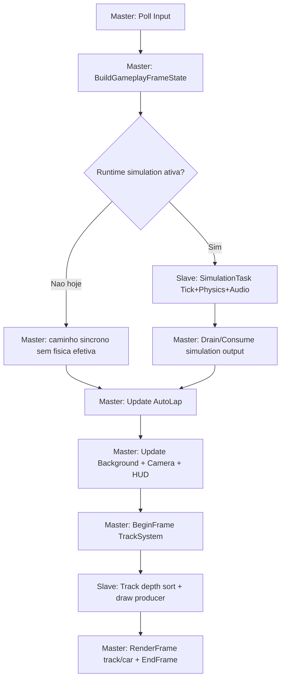
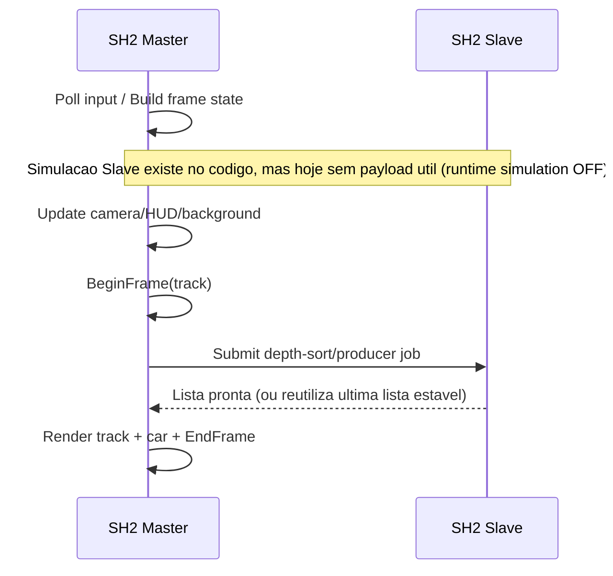

# Uso Atual das Duas SH2 (Master + Slave)

Este documento descreve **como o projeto esta usando hoje** as SH2 no runtime atual da branch.

## 1) Resumo Executivo

- Hoje, a SH2 Master controla todo o frame loop e o render.
- A SH2 Slave esta ativa principalmente para o pipeline de pista (producer/sort), com fallback sincrono seguro.
- A simulacao de gameplay/fisica esta **desligada** no runtime atual (`enableRuntimeSimulation = false`), entao nao ha carga util de fisica na Slave neste momento.

## 2) Mapa de Responsabilidades (Hoje)

| Bloco | SH2 Principal | Estado Atual | Referencias |
|---|---|---|---|
| Loop do frame (input, HUD, camera, render) | Master | Ativo | `src/game_loop_system.hpp` |
| Simulacao gameplay/fisica/audio | Slave (quando habilitado) | Desligado por config | `src/main.cxx:1051`, `src/main.cxx:1075` |
| Producer de draw list da pista | Slave com fallback | Ativo | `src/track_draw_producer.hpp:429`, `src/track_draw_producer.hpp:485` |
| Depth sort estabilizado da pista | Slave com fallback | Ativo | `src/track_draw_producer.hpp:100`, `src/track_draw_producer.hpp:156` |
| Car prepare task (normalizacao de yaw) | Slave (opcional) | Desligado | `src/main.cxx:649`, `src/game_loop_system.hpp:1128` |

## 3) Configuracao Atual Relevante

| Chave | Valor Atual | Efeito |
|---|---|---|
| `enableRuntimeSimulation` | `false` | Nao injeta `trackCollision`, `carPhysics`, `gameplayTick`, `audioEvents` no loop |
| `loopContext.enableSlaveForSimulation` | `true` | Flag pronta, mas sem payload de simulacao (por causa da linha acima) |
| `loopContext.enableSlaveForCarPrepare` | `false` | Nao agenda `carPrepareTask_` |
| `trackConfig.useSlave` | `true` | Ativa modo dual para producer/sort da pista |
| `kEnableTrackSlaveBarrierLockstep` | `false` | Modo non-lockstep (Master evita bloquear por padrao) |

Referencias:
- `src/main.cxx:649`
- `src/main.cxx:650`
- `src/main.cxx:734`
- `src/main.cxx:857`
- `src/main.cxx:1051`
- `src/track_system.cxx:270`

## 4) Diagrama do Frame (Estado Atual)

## 5) Janela de Concorrencia Master x Slave

## 6) Protecoes de Estabilidade Entre as SH2

| Mecanismo | Onde | Objetivo |
|---|---|---|
| Drain de simulacao antes da janela da pista | `DrainSimulationJobIfInFlight(true)` | Evitar conflito com jobs de producer no Slave |
| Backoff de dispatch da simulacao | `kSimSlaveBackoffFrames` | Reduzir disputa quando pista ocupa o Slave |
| Timeout + safe mode no producer/sorter | `timeoutFallbacks`, `safeMode*` | Evitar travas longas e manter frame andando |
| Fallback sincrono | `ApplyJob(...)` local | Garantir continuidade quando Slave atrasa/desabilita |
| Re-enable por cooldown | `recoveryFrames_` | Retomar uso do Slave apos estabilizar |

Referencias:
- `src/game_loop_system.hpp:935`
- `src/game_loop_system.hpp:1069`
- `src/track_draw_producer.hpp:20`
- `src/track_draw_producer.hpp:306`
- `src/track_draw_producer.hpp:367`

## 7) Telemetria SH2 Disponivel Hoje

| Categoria | Campos |
|---|---|
| Master ticks | `stream`, `draw`, `frame`, `maintenance`, `window`, `prefetch`, `lod`, `workingSet` |
| Slave ticks | `slaveLastJobTicks`, `slaveMaxJobTicks`, `sh2SlaveSortTicksThisFrame_`, `sh2SlavePlanTicksThisFrame_` |
| Qualidade do producer | `jobInFlight`, `reusedPreviousList`, `timeoutFallbacks`, `safeModeTriggers`, `safeModeFrames` |
| Modo de execucao | `trackSlaveModeRequested_`, producer/sort ativo, lockstep flag |

Referencias:
- `src/track_system.hpp:144`
- `src/track_system.hpp:662`
- `src/track_system.cxx:16085`
- `src/track_system.cxx:16161`

## 8) Pontos Importantes para o Time

1. Hoje o projeto esta em modo hibrido: **dual-SH2 para pista**, mas **simulacao de carro/fisica desativada**.
2. Se reativar `enableRuntimeSimulation`, a infraestrutura de dispatch/drain da simulacao em Slave ja existe e volta a operar.
3. O gargalo/instabilidade do Slave na pista ja tem mecanismos de degradacao controlada (safe mode + fallback sincrono).
4. O comportamento de alternancia DUAL/SINGLE da pista pode ser acionado em runtime (via `SetTrackSlaveMode` no loop de input).

