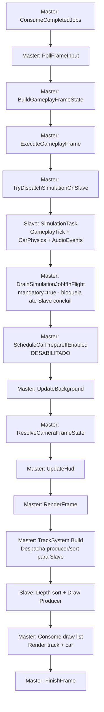
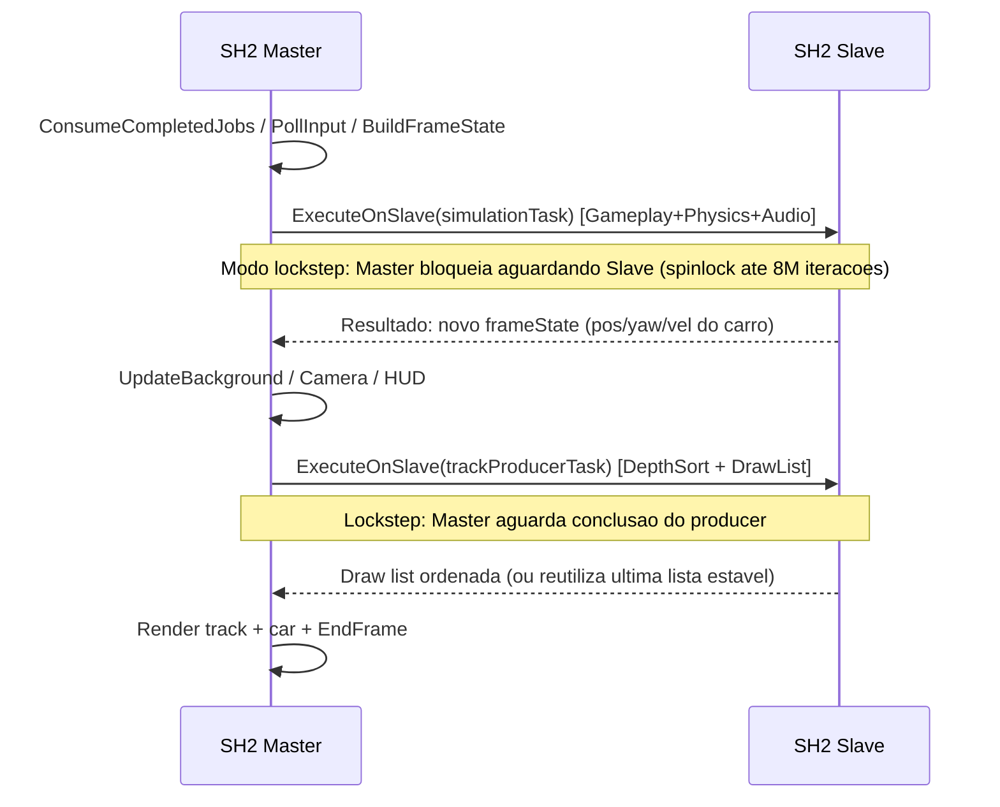

# Uso Atual das Duas SH2 (Master + Slave)

Este documento descreve **como o projeto esta usando hoje** as SH2 no runtime atual da branch.

> Atualizado em 2026-06-07 com base na analise direta de `main.cxx`, `game_loop_system.hpp`,
> `track_system.cxx` e `track_draw_producer.hpp`.

---

## 1) Resumo Executivo

- Master: orquestra o frame loop completo, renderizacao, camera e HUD.
- Slave: executa **simulacao de gameplay/fisica/audio** (lockstep) + **producer/sort de draw list da pista** (com safe mode e fallback sincrono).
- `enableRuntimeSimulation = true` e `enableSlaveForSimulation = true`: simulacao **ativa** e despachada para a Slave em modo lockstep.
- `enableSlaveForCarPrepare = false`: normalizacao de yaw do carro nao e despachada.
- Ambas as tarefas Slave (simulacao e pista) possuem fallback sincrono robusto.

---

## 2) Mapa de Responsabilidades (Hoje)

| Bloco | SH2 Principal | Estado Atual | Referencias |
|---|---|---|---|
| Loop do frame (input, camera, HUD, render) | Master | Ativo | `src/game_loop_system.hpp` |
| Simulacao gameplay/fisica | **Master** (sync) | **Ativo** | Slave livre so para pista; sem contencao de job |
| Audio PCM driver | Master | **Ativo** | OnFrame apos commit da sim |
| Producer de draw list da pista | Slave com fallback | Ativo (**async**, sem barrier) | `kEnableTrackSlaveBarrierLockstep=false` |
| Depth sort estabilizado da pista | **Master** (sync) | Ativo | Com barrier async so 1 job Slave: sort nao usa Slave |
| Car prepare task (normalizacao de yaw) | Slave (opcional) | Desligado | `src/main.cxx:1650` |

---

## 3) Configuracao Atual Relevante

### Flags de alto nivel (main.cxx)

| Chave | Valor Atual | Efeito |
|---|---|---|
| `enableRuntimeSimulation` | `true` | Injeta `gameplayTick`, `carPhysics`, `audioEvents` no loop |
| `enableSlaveSimulation` | `false` | Fisica na Master (sync); evita disputa com track na Slave |
| `slaveSimulationLockstep` | `true` (N/A se sim off) | Reservado se reativar sim na Slave |
| `enableSlaveForCarPrepare` | `false` | Nao agenda `carPrepareTask_` |
| `trackConfig.useSlave` | `true` | Ativa modo dual para producer/sort da pista |

### Constantes do track (track_system.cxx)

| Constante | Valor | Efeito |
|---|---|---|
| `kEnableTrackRuntimeStabilization` | `true` | Ativa mecanismo de safe mode e depth-sort estabilizado |
| `kEnableStabilizedDepthSortOnSlave` | `true` | Depth-sort executado na Slave |
| `kEnableStabilizedProducerOnSlave` | `true` | Producer executado na Slave |
| `kEnableTrackSlaveBarrierLockstep` | `false` | Master **nao** aguarda job de pista; reusa lista pronta (N/N-1) |

### Constantes do game loop (game_loop_system.hpp)

| Constante | Valor | Efeito |
|---|---|---|
| `kSimDrainSoftSpinLimit` | `512K spins` | Threshold de monitoramento: ativa backoff apos softTimeout |
| `kSimDrainHardSpinLimit` | `8M spins` | Limite maximo absoluto antes de render |
| `kSimSlaveBackoffFrames` | `6 frames` | Pausa no despacho da simulacao apos soft-timeout |

Referencias:
- `src/main.cxx:1646-1650`
- `src/game_loop_system.hpp:161-163`
- `src/track_system.cxx:268-298`

---

## 4) Diagrama do Frame (Estado Atual)



---

## 5) Janela de Concorrencia Master x Slave



---

## 6) Simulacao na Slave — Fluxo Detalhado

### TryDispatchSimulationOnSlave (game_loop_system.hpp:1328)

Pre-condicoes para despacho:
1. `simState_.slaveBackoffFrames == 0` — nao em periodo de backoff
2. Nenhuma outra tarefa em voo (simulacao ou carPrepare)
3. Track producer nao esta em voo

Se OK: configura payload com `gameplayFrameState`, chama `SRL::Slave::ExecuteOnSlave(simulationTask_)`, ativa double-buffer (`writeIdx ^= 1`).

### DrainSimulationJobIfInFlight (game_loop_system.hpp:1197)

```
Mandatory wait (lockstep = true):
  1. Spin ate kSimDrainSoftSpinLimit (512K)
     -> Se timeout: ativa BackoffSimulationSlaveDispatch (6 frames)
  2. Spin ate kSimDrainHardSpinLimit (8M)
     -> Se ainda nao concluiu: hard-wait infinito ate conclusao
  3. Aplica resultado e registra masterWaitTicksThisFrame
```

---

## 7) Track Producer/Sort na Slave — Protecoes

| Mecanismo | Onde | Objetivo |
|---|---|---|
| Limite de frames em voo | `maxFramesInFlight_ = 2` | Detecta Slave travada apos 2 frames de latencia |
| Safe mode por stall | `safeModeStallThreshold_ = 4` | Entra em safe mode apos 4 reutilizacoes consecutivas |
| Safe mode cooldown | `safeModeCooldownFrames_ = 90` | Executa producer sincronamente por 90 frames |
| Recovery | `recoveryFrames_ = 120` | Tenta reabilitar Slave apos 120 frames em safe mode |
| Fallback sincrono | `ApplyJob(...)` local | Garante draw list valida quando Slave nao disponivel |
| Drain de simulacao antes do producer | `DrainSimulationJobIfInFlight(true)` | Evita conflito com job de simulacao ainda em voo |
| Backoff da simulacao | `kSimSlaveBackoffFrames = 6` | Reduz disputa quando a Slave esta sob pressao |

Referencias:
- `src/track_draw_producer.hpp:416-422` (constantes de timeout)
- `src/track_draw_producer.hpp:443-511` (logica de Build)
- `src/track_draw_producer.hpp:349-365` (UpdateSafeModeState)
- `src/game_loop_system.hpp:935` (drain antes da janela de pista)
- `src/game_loop_system.hpp:1197` (DrainSimulationJobIfInFlight)
- `src/game_loop_system.hpp:1328` (TryDispatchSimulationOnSlave)

---

## 8) Telemetria SH2 Disponivel Hoje

### Sh2SplitTelemetrySnapshot (game_loop_system.hpp:220)

| Campo | Descricao |
|---|---|
| `trackMasterTicks` | Ciclos do Master em track |
| `trackSlaveProducerTicks` | Ciclos da Slave em draw producer |
| `trackSlaveSortTicks` | Ciclos da Slave em depth sort |
| `trackSlavePlanTicks` | Ciclos da Slave em plan |
| `simSlaveTicks` | Ciclos da Slave em simulacao |
| `simMasterWaitTicks` | Ciclos do Master aguardando Slave (lockstep) |
| `masterBusyTicks` | Ciclos totais do Master |
| `masterWaitTicks` | Ciclos totais de wait |
| `slaveWorkTicks` | Ciclos totais da Slave |

### TrackDrawProducerStats (track_draw_producer.hpp:14)

| Campo | Descricao |
|---|---|
| `jobsSubmitted` / `jobsCompleted` | Contadores de jobs |
| `reusedPreviousList` | Vezes que a draw list anterior foi reutilizada |
| `synchronousBuilds` | Builds sincronos (safe mode ou Slave desabilitada) |
| `timeoutFallbacks` | Timeouts detectados por `maxFramesInFlight` |
| `consecutiveTimeouts` | Timeouts consecutivos acumulados |
| `safeModeTriggers` / `safeModeFrames` | Ativacoes e duracao de safe mode |
| `slaveReenabledCount` | Vezes que Slave foi reabilitada apos recovery |
| `slaveLastJobTicks` / `slaveMaxJobTicks` | Ciclos do ultimo job e pico historico |
| `slaveDisabledByTimeout` / `safeModeActive` | Flags de estado atual |

Referencias:
- `src/track_system.hpp:144`
- `src/track_system.hpp:662`
- `src/track_system.cxx:16085`
- `src/track_system.cxx:16161`

---

## 9) Pontos Importantes para o Time

1. O projeto esta em **modo dual-SH2 completo**: simulacao de fisica na Slave (lockstep) + producer/sort de pista na Slave (com safe mode).
2. O modo **lockstep** significa que o Master bloqueia ate a Slave concluir — ha paralelismo real de trabalho, mas nao de latencia: o frame so avanca quando Slave termina.
3. O **safe mode** do producer protege contra travamentos da Slave: detecta stall em 4 frames e opera sincronamente por 90 frames antes de tentar recovery em 120 frames.
4. O alternancia DUAL/SINGLE da pista pode ser acionada em runtime via `SetTrackSlaveMode` (input Y + Z no game loop).
5. Se `enableSlaveForCarPrepare` for reativado, a `CarRenderPrepareTask` (normalizacao de yaw) voltara a ser despachada para a Slave; e uma tarefa trivial e o impacto e minimo.
6. A telemetria `simMasterWaitTicks` e a metrica mais importante para avaliar o custo do lockstep: mede quanto tempo o Master fica parado esperando a Slave.

---

## 10) Fluxo Completo de um Frame (Referencia Rapida)

```
Frame N:
  Master: ConsumeCompletedJobs()         [aplica resultado de SimTask N-1 se disponivel]
  Master: PollFrameInput()
  Master: BuildGameplayFrameState()
  Master: TryDispatchSimulationOnSlave() [Slave: Tick+Physics+Audio - LOCKSTEP]
  Master: DrainSimulationJobIfInFlight() [bloqueia ate Slave concluir - spinlock]
  Master: ScheduleCarPrepareIfEnabled()  [NOOP - desabilitado]
  Master: UpdateBackground()
  Master: ResolveCameraFrameState()
  Master: UpdateHud()
  Master: RenderFrame()
    Master: TrackSystem::Build()         [Slave: DepthSort + DrawProducer - LOCKSTEP]
    Master: Consome draw list da Slave
    Master: Render track + car (VDP1/VDP2)
  Master: FinishFrame()
```
