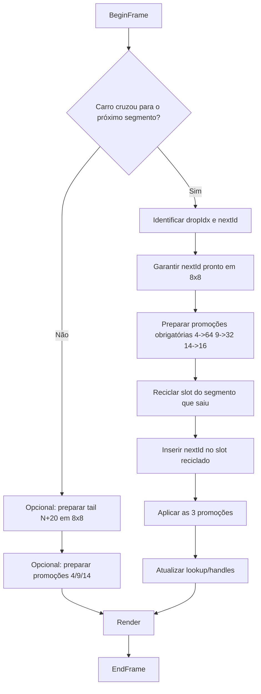
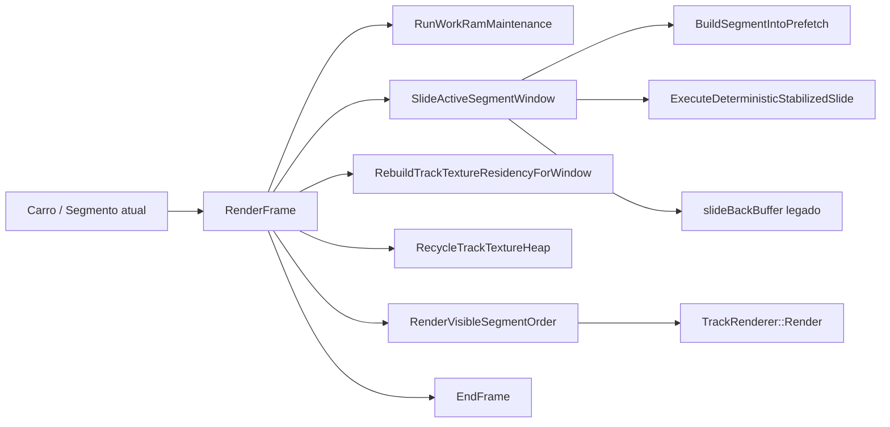

# Track Streaming Runtime Diagram

## Objetivo

A pista deve operar como uma janela deslizante fixa de `20` segmentos.

Contrato visual:

- `4` segmentos em `64x64`
- `5` segmentos em `32x32`
- `5` segmentos em `16x16`
- `6` segmentos em `8x8`

Contrato de slide:

- sai `1` segmento da frente
- entra `1` novo segmento no fim em `8x8`
- o antigo rank `4` sobe para `64x64`
- o antigo rank `9` sobe para `32x32`
- o antigo rank `14` sobe para `16x16`

Em outras palavras, a janela sempre deve ficar:

```text
rank  0..3   -> 64x64
rank  4..8   -> 32x32
rank  9..13  -> 16x16
rank  14..19 -> 8x8
```

Se a janela é fixa e o segmento que sai é reciclado de verdade, o uso de memória da pista deve ficar quase constante ao longo da corrida.

## Exemplo

```text
Carro no segmento 1
Segs:  1  2  3  4 | 5  6  7  8  9 | 10 11 12 13 14 | 15 16 17 18 19 20
LOD : 64 64 64 64 |32 32 32 32 32 | 16 16 16 16 16 |  8  8  8  8  8  8

Carro no segmento 2
Segs:  2  3  4  5 | 6  7  8  9 10 | 11 12 13 14 15 | 16 17 18 19 20 21
LOD : 64 64 64 64 |32 32 32 32 32 | 16 16 16 16 16 |  8  8  8  8  8  8
```

## Fluxo ideal por frame



Princípio:

- `0` ou `1` slide por frame
- `1` segmento novo por slide
- no máximo `3` promoções por slide
- nenhum outro subsistema deve “mandar” no LOD da janela no modo estabilizado

## Fluxo real atual

Hoje o runtime da pista passa por estes blocos:

1. `TrackSystem::Initialize()`
2. `PrepareInitialSegmentPackages()`
3. `BuildSegmentRenderers()`
4. `RebuildTrackTextureResidencyForWindow()`
5. `RenderFrame()`
6. `RunWorkRamMaintenance()`
7. `SlideActiveSegmentWindow()`
8. `ExecuteDeterministicStabilizedSlide()` ou caminho legado de `slideBackBuffer`
9. `BuildSegmentIntoPrefetch()`
10. `RenderVisibleSegmentOrder()`
11. `RecycleTrackTextureHeap()` / rebuild de textura
12. `EndFrame()`

Em termos de estado vivo, ainda existem estes grupos:

- janela ativa dos `20` segmentos
- `slideScratchRenderer_`
- `slidePrefetchRenderer_`
- `slidePrefetchFamilyIds_`
- `slidePrefetchFaceSlots_`
- scratch de `slideIncoming*`
- scratch de `slideRollback*`
- slots e filas de reciclagem de textura
- coordinator/pool de draw
- caches internos do `TrackRenderer`
- blobs/scratch de carregamento de `RDR/SDR/BDR/GEO/MAT`

## Diagrama do runtime atual



Problema central:

- a regra visual de `20` segmentos está correta
- mas o runtime ainda mantém estado auxiliar demais vivo ao redor dessa janela
- isso faz o `free` cair volta após volta

## Leitura dos logs atuais

Padrão observado nos logs mais recentes:

- primeira volta fluida
- depois o frame rate cai progressivamente
- `free` vai reduzindo até chegar perto de `0`
- depois surgem:
  - `PKG slide low step`
  - lacunas
  - perda de segmentos
  - travamento

Sinais importantes:

- a janela lógica segue correta por bastante tempo
- a degradação não começa porque “o segmento antigo ficou preso”
- o acúmulo acontece em buckets ligados à pista fora do miolo `20 segmentos`

## Hipótese consolidada

O problema não é o contrato da janela. O problema é a desmobilização incompleta do estado auxiliar do streaming.

Hoje há sinais de retenção em três áreas:

1. `TrackCore`
   Estado persistente da pista que ainda continua na `HighWorkRam`.

2. `TrackPrepare`
   Preparação de slide/prefetch/repair mantendo muitos blocos vivos.

3. `TrackTexture`
   Estado de textura e rebind residindo mais tempo do que deveria.

## Onde o risco é maior

### 1. Prefetch e slide

Mesmo com o caminho determinístico novo, ainda existe estado de prefetch persistente:

- `slidePrefetchSegmentId_`
- `slidePrefetchFamilyIds_`
- `slidePrefetchFaceSlots_`
- `slidePrefetchRenderer_`

Se esse bloco não volta ao piso após o commit do slide, o custo cresce ao longo das voltas.

### 2. Caches internos do renderer

O `TrackRenderer` ainda tem caches internos por mesh.

Se esses caches:

- crescem com o pior caso
- não são desativados para segmentos streamados
- ou são usados em caminhos que não precisam deles

então a memória deixa de ser constante.

### 3. Pipeline de textura

O segmento que sai da janela precisa:

- perder seus refs de working set
- colocar slot/palette em reciclagem segura
- não manter shadow state desnecessário

Se o runtime mantém metadados extras por face/família além do necessário, o custo vai se acumulando.

## Regra de ouro para corrigir

No modo estabilizado, a pista precisa viver com memória determinística:

```text
20 ativos
+ 1 scratch
+ 1 prefetch
+ buffers fixos de slots/famílias no pior caso do pack
= custo estável
```

Qualquer crescimento monotônico de `free` para baixo significa bug.

## Plano de correção

### Etapa 1. Uma única fonte de verdade para o slide

Manter só o caminho:

- `BuildSegmentIntoPrefetch(nextId)`
- `ExecuteDeterministicStabilizedSlide(dropIdx, nextId, nextStartId)`

No modo estabilizado, o caminho legado de `slideBackBuffer` não deve mais influenciar o slide.

### Etapa 2. Memória fixa da janela

Pré-alocar uma vez:

- `20` renderers ativos
- `1` scratch
- `1` prefetch
- vetores de face slots / family ids com capacidade máxima do pack

Durante a corrida:

- não fazer `reserve` crescente
- não criar novos containers persistentes

### Etapa 3. Zerar o custo do prepare após o slide

Após commit do slide:

- o scratch do segmento que saiu deve ser reciclado no mesmo frame
- o prefetch antigo deve ser desmontado se não for o próximo `N+20`
- qualquer vetor auxiliar deve voltar ao piso

### Etapa 4. Desligar repair difuso no modo estabilizado

No modo estabilizado, o draw não deve virar lugar de correção.

`RenderVisibleSegmentOrder()` deve:

- renderizar
- no máximo logar inconsistência

e não manter mecanismos paralelos de recuperação mandando no LOD.

### Etapa 5. Separar bug de textura do bug de memória

O problema visual do segmento `173` na 1a volta parece outro bug:

- texture slot
- palette
- rebind

Ele deve ser tratado depois da memória da pista estabilizar.

## Checklist de aceite

### Memória

- `free` não pode cair monotonicamente volta após volta
- `TrackCore`, `TrackPrepare` e `TrackTexture` precisam estabilizar
- a pista deve operar com custo quase constante

### Slide

- `WIN N..N+19 -> N+1..N+20`
- exatamente `1` slide por transição de segmento
- o segmento que sai libera o slot para o segmento que entra

### LOD

- `TRK band` deve ficar:
  - `64:4`
  - `32:5`
  - `16:5`
  - `8:6`

### Performance

- sem queda progressiva de FPS ao longo das voltas
- objetivo operacional: `30 fps`

## Resposta curta

A janela de `20` segmentos está conceitualmente correta. O problema está no estado auxiliar que continua vivo ao redor dela.

Para corrigir:

1. reduzir o modo estabilizado para `20 + 1 + 1`
2. parar de manter buffers persistentes duplicados para slide/prefetch/texture
3. fixar a memória da pista em pools/capacidades máximas
4. só depois tratar os glitches visuais de textura
